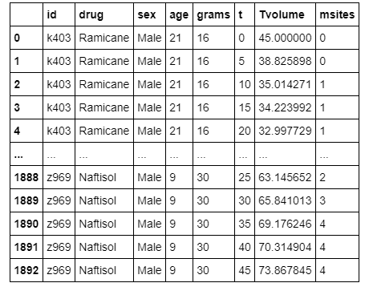

## Using Matplotlib to Visualize Data

### Investigating the Effects of Four Cancer Treatments on Tumor Size in Mice

#### Raw Data

#### Removing Mice with Duplicate Time Points ("t")

        /# Getting the duplicate mice by ID number that shows up for Mouse ID and Timepoint.
        problem_mice = [] #list of mice with more than one timepoint.
        for id in d.id: #Looping thru mice in data series
            unique_timepoints = []
            for timepoint in d[d.id == id].loc[:, 't']: #Looping thru time points for each mouse
                if timepoint not in unique_timepoints:
                    unique_timepoints.append(timepoint)
                else:
                    if id not in problem_mice: 
                        problem_mice.append(id)
        problem_mice

        /# Create a clean DataFrame by dropping the duplicate mouse by its ID.
        good_mice = d.id.unique()
        good_mice = list(good_mice)
        for good_mouse in good_mice:
                if good_mouse in problem_mice:
                    good_mice.remove(good_mouse)
        cd = pd.DataFrame(problem_data.loc[good_mice,:]) #cd stands for "clean data"
        cd.reset_index(inplace=True)
        cd # clean data
