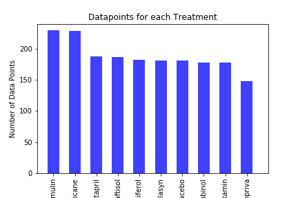
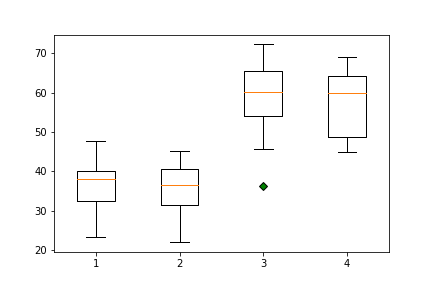
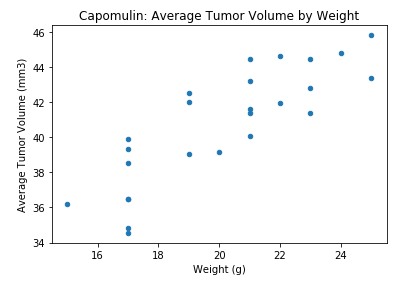
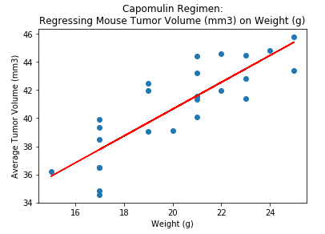

## Using Matplotlib to Visualize Data

### Investigating the Effects of Four Cancer Treatments on Tumor Size in Mice

#### Raw Data

)
#### Datapoints for each Treatment

#### Male Vs Females and Treatment

#### Average Tumor Volume by Weight (gs)

#### Regression

